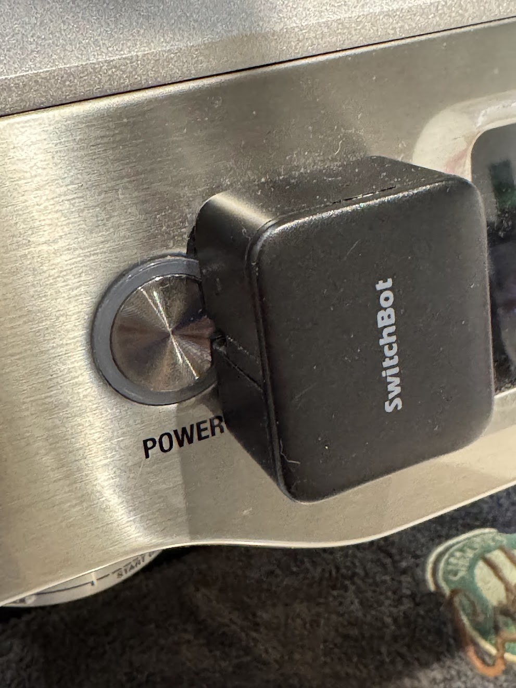
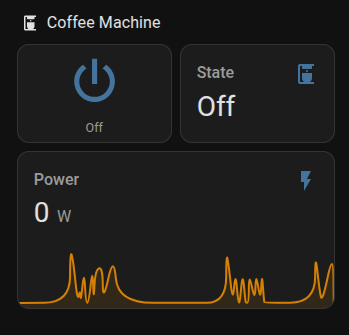

[]
(https://my.home-assistant.io/redirect/blueprint_import/?blueprint_url=https://raw.githubusercontent.com/simonjgreen/coffee-machine-state-manager/main/blueprints/automation/simongreen/coffee_machine_state_manager.yaml)

# Coffee Machine State Manager (Home Assistant Blueprint)

This blueprint keeps two helpers in sync with a coffee machine's real-world state using power draw, and toggles a SwitchBot (or similar) when you flip a "desired power" helper. This allows you to drive a machine with a Switchbot (or similar) and not end up in an inconsistent state with reality.

## What you get

- **input_select** shows derived state: `Off`, `Heating`, `Ready`
- **input_boolean** acts like a simple on/off control you can put on a dashboard
- Power draw is used to infer state:
  - `< Off below (W)` => Off
  - `between Off below and Heating above` (stable for N seconds) => Ready
  - `> Heating above (W)` => Heating

## Prerequisites

- A smart plug power sensor entity in watts (e.g. `sensor.my_plug_power`)
- A switch entity that toggles the coffee machine power button (e.g. SwitchBot: `switch.my_switchbot`)

## Step 1: Create the helpers

### A) Desired power boolean
Settings → Devices & services → Helpers → **Create Helper** → **Toggle**
- Name: `Coffee Machine Power`
- Entity ID (optional): `input_boolean.coffee_machine_power`

### B) Derived state select
Settings → Devices & services → Helpers → **Create Helper** → **Dropdown**
- Name: `Coffee Machine State`
- Options (exactly):
  - `Off`
  - `Heating`
  - `Ready`
- Entity ID (optional): `input_select.coffee_machine_state`

## Step 2: Import the blueprint

1. Copy `coffee_machine_state_manager.yaml` into:
   `config/blueprints/automation/<yourname>/coffee_machine_state_manager.yaml`
2. Restart Home Assistant (or reload automations).
3. Go to Settings → Automations & Scenes → Blueprints → find **Coffee Machine State Manager**.

## Step 3: Create an automation from the blueprint

When creating the automation, select:
- Power sensor (W)
- SwitchBot switch
- Your two helpers
- Thresholds:
  - Off below (W): default 5
  - Heating above (W): default 100
- Debounce:
  - Ready hold seconds: default 5
  - Off hold seconds: optional, default 0

## Dashboard suggestions

- Entities card with:
  - `input_boolean.coffee_machine_power`
  - `input_select.coffee_machine_state`
  - `sensor.<your_power_sensor>` (optional)

## Notes / Caveats

- This uses `switch.toggle` for the actuator, so it assumes a button press is always the right action.
- If your SwitchBot sometimes misses presses, consider increasing the SwitchBot press duration in its integration, or add a retry/notification layer.
